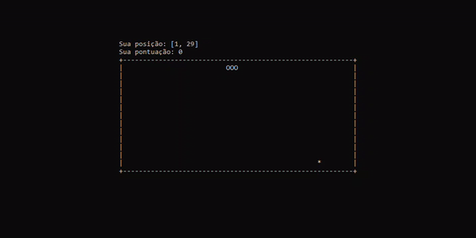

# Snake Py

Essa é uma implementação do jogo da cobrinha usando python. O jogo roda em cima da biblioteca ```curses``` e só precisa dessa bilbioteca externa.



## Instalação

Pra instalar e rodar o jogo, basta clonar esse projeto (```git clone https://github.com/henriquezanfa/snake-py.git```) e rodar com o comando ```py main.py```.

